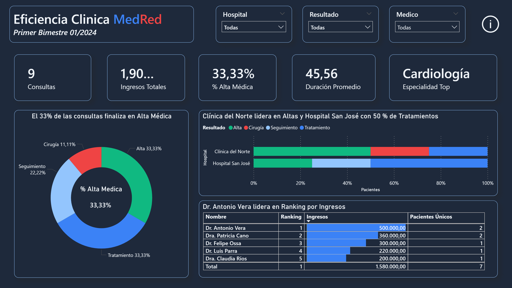
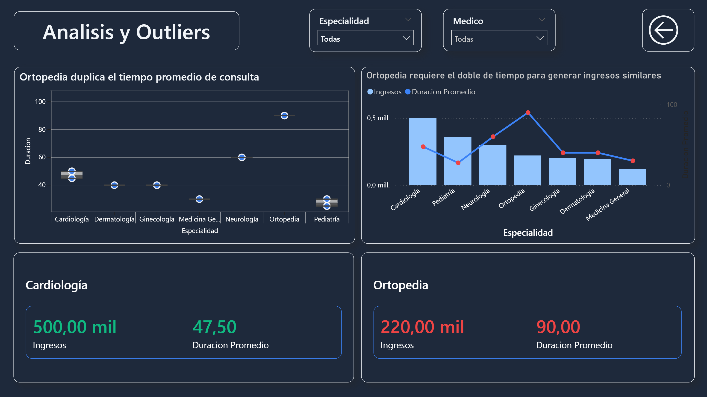
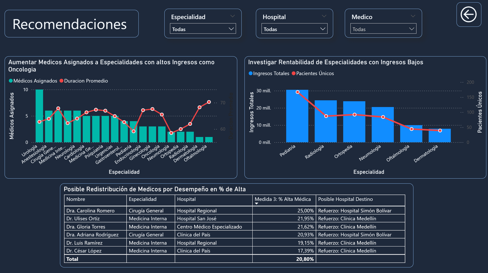

# 🏥 Proyecto 4: Red de Hospitales y Atención Médica (MedRed)
**Eficiencia Clínica, Ingresos y Desempeño por Especialidad**

Este repositorio contiene un proyecto avanzado de Business Intelligence desarrollado en **Power BI Desktop**, utilizando el formato de proyecto mejorado (`.pbip` / `.pbir`) para habilitar el control de versiones y el trabajo colaborativo mediante **Git y GitHub**.

---

## 🚀 Cómo trabajar colaborativamente en este proyecto

Dado que este proyecto no usa un `.pbix` tradicional, sigue estos pasos para clonar e "hidratar" el modelo en tu máquina local:

### 1. Clonar y Abrir
1. Clona este repositorio en tu máquina local: `git clone git@github.com:KennyWong2024/project-power-bi-pbir.git`
2. **NO** intentes abrir las carpetas directamente. Haz doble clic en el archivo `MedRed Clinic Efficiency.pbip`. Power BI Desktop se abrirá y cargará la estructura del proyecto.
3. Es normal que al inicio las gráficas aparezcan en blanco o con advertencias. Esto ocurre porque las rutas locales de los datos no coinciden con las de tu equipo.

### 2. Conectar los Datos (El Parámetro `RutaBase`)
Para evitar conflictos en Git con las rutas locales de los archivos `.csv` (Pacientes, Médicos, Consultas), hemos implementado un parámetro en Power Query.
1. En Power BI, ve a **Transformar datos** > **Editar parámetros**.
2. Busca el parámetro `RutaBase` y cambia la ruta por la ubicación donde tienes la carpeta de datos en tu computadora (ej. `C:\Users\TuUsuario\Proyectos\MedRed\data\`).
3. Haz clic en **Aceptar** y luego en **Actualizar todo** en la vista de reporte. ¡El modelo se hidratará y las gráficas aparecerán!

> ⚠️ **IMPORTANTE PARA COMMITS:** Al hacer un cambio visual o de DAX, asegúrate de **NO** hacer commit de los archivos donde solo cambió tu `RutaBase` local, para no sobrescribir la configuración de tu compañero en el repositorio remoto.

---

## 🎨 Diseño y UI/UX

Para este dashboard, nos alejamos de las plantillas tradicionales y construimos una interfaz moderna optimizada para modo oscuro, garantizando legibilidad y un Data Storytelling claro (Estructura de 3 Actos).

### Paleta de Colores: "Semáforo Moderno"
Utilizamos una paleta semántica suave para evitar la fatiga visual:
* 🟢 **Alta (Éxito):** `#10B981` (Verde Esmeralda)
* 🔴 **Cirugía (Alerta/Costo):** `#EF4444` (Rojo Coral)
* 🔵 **Tratamiento/Seguimiento (Neutros):** `#3B82F6` / `#93C5FD`
* 🌑 **Fondos:** `#1E293B` con textos en `#F8FAFC` y `#CBD5E1`.

---

## 📊 Vistas del Dashboard

El reporte está estructurado para responder preguntas de negocio específicas siguiendo un hilo narrativo:

### Página 1: Resumen Ejecutivo (Acto 1)
Visión macro de los KPIs. Identifica rápidamente el % de Alta Médica global, los ingresos generados y los médicos top en facturación.

### Página 2: Análisis y Outliers (Acto 2)
*(Añadir descripción breve cuando la página esté terminada)*

### Página 3: [En proceso] (Acto 3)
*(Añadir descripción breve cuando la página esté terminada)*

---

## 🛠️ Requisitos Técnicos y Arquitectura de Datos

* **Limpieza de Datos:** Resolución de errores de tipado e inconsistencias usando Power Query.
* **Modelo de Datos:** Implementación de un modelo de estrella resolviendo la **Relación Muchos a Muchos** (Tabla A: Pacientes, Tabla B: Médicos, Tabla Puente: Consultas).
* **DAX:** Se implementaron 5 medidas críticas bajo mejores prácticas (uso de iteradores `SUMX`, modificadores de contexto `CALCULATE` y prevención de errores con `DIVIDE`).
    1. Total Consultas
    2. Ingresos Médicos (Filtrando tarifas nulas/cero)
    3. % Alta Médica
    4. Duración Promedio (Con línea de referencia constante)
    5. Pacientes Únicos por Médico (`DISTINCTCOUNT`)

---
*Revisa el archivo `Indicaciones del Proyecto.pdf` para consultar las directrices originales y el diccionario de datos.*