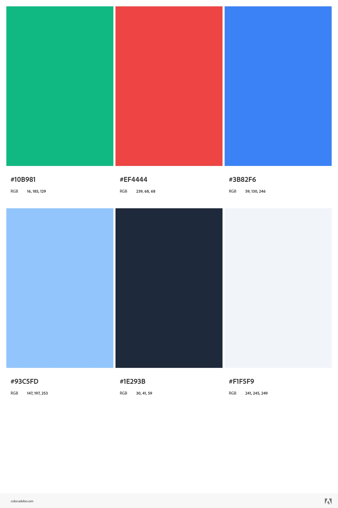
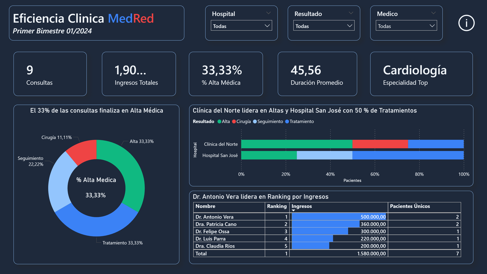
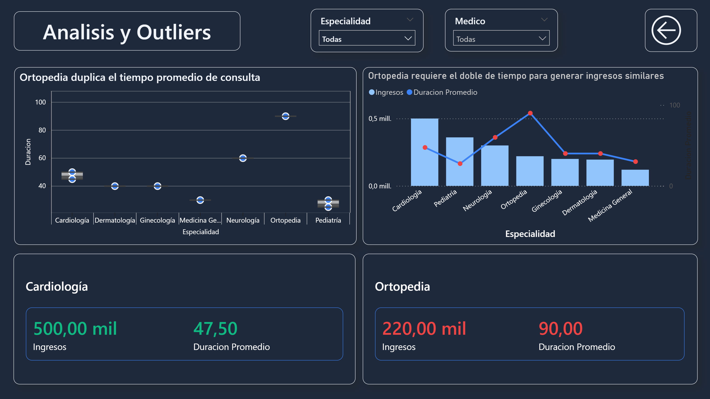
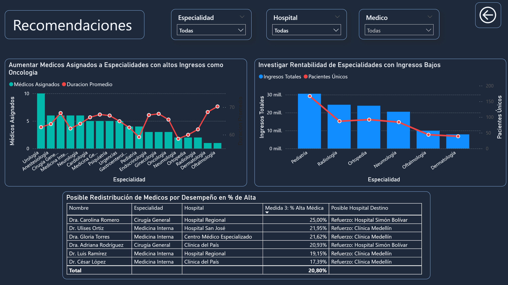

<div align="center">

# 🏥 MedRed — Red de Hospitales y Atención Médica
### *Business Intelligence para Eficiencia Clínica, Ingresos y Desempeño por Especialidad*


---

*Un dashboard de clase empresarial construido en Power BI Desktop con arquitectura `.pbip / .pbir` para máxima colaboración y control de versiones.*

</div>

---

## 📋 Tabla de Contenidos

1. [Visión General del Proyecto](#-visión-general-del-proyecto)
2. [Estructura del Repositorio](#-estructura-del-repositorio)
3. [Primeros Pasos: Setup Colaborativo](#-primeros-pasos-setup-colaborativo)
4. [Arquitectura de Datos](#-arquitectura-de-datos)
5. [Diseño y UI/UX](#-diseño-y-uiux)
6. [Métricas DAX Implementadas](#-métricas-dax-implementadas)
7. [Vistas del Dashboard](#-vistas-del-dashboard)
8. [Roadmap](#-roadmap)
9. [Contribuidores](#-contribuidores)

---

## 🔭 Visión General del Proyecto

**MedRed** es un proyecto avanzado de Business Intelligence diseñado para transformar datos clínicos crudos en inteligencia accionable. El objetivo central es responder tres preguntas críticas de negocio:

> **¿Qué médicos y especialidades generan mayor valor económico para la red de hospitales?**
> **¿Cuáles son los cuellos de botella en eficiencia clínica?**
> **¿Qué factores predicen una alta médica exitosa y rápida?**

El proyecto sigue una narrativa de **Data Storytelling en 3 Actos** — desde el diagnóstico macro hasta la resolución y las llamadas a la acción concretas.

### ✨ Características Técnicas Destacadas

| Característica | Detalle |
|---|---|
| 📁 Formato de proyecto | `.pbip / .pbir` (colaborativo, apto para Git) |
| 🗄️ Modelo de datos | Esquema Estrella con tabla puente |
| ⚙️ Transformaciones | Power Query con parámetro dinámico `RutaBase` |
| 📐 DAX | Iteradores, modificadores de contexto, control de errores |
| 🎨 Diseño | Modo oscuro con paleta semántica personalizada |

---

## 📂 Estructura del Repositorio

```
MedRed/
│
├── 📄 MedRed Clinic Efficiency.pbip       ← Punto de entrada principal
│
├── 📁 MedRed Clinic Efficiency.Report/    ← Definición de páginas y visuales
│   ├── definition/
│   │   └── pages/
│   └── ...
│
├── 📁 MedRed Clinic Efficiency.SemanticModel/  ← Modelo de datos y DAX
│   ├── definition/
│   │   ├── expressions.tmdl               ← ⚠️ Contiene RutaBase (gestionar con --skip-worktree)
│   │   ├── tables/
│   │   └── relationships.tmdl
│   └── ...
│
├── 📁 data/                               ← Archivos CSV de origen
│   ├── pacientes.csv
│   ├── medicos.csv
│   └── consultas.csv
│
└── 📄 Indicaciones del Proyecto.pdf       ← Diccionario de datos y lineamientos
```

---

## 🚀 Primeros Pasos: Setup Colaborativo

> **¿Por qué este proceso?** El formato `.pbip` descompone el proyecto en archivos de texto plano, lo que lo hace ideal para Git. La única fricción es que las rutas locales a los archivos `.csv` son diferentes en cada máquina. El parámetro `RutaBase` resuelve esto elegantemente.

### Paso 1 — Clonar el repositorio

```bash
git clone git@github.com:KennyWong2024/project-power-bi-pbir.git
cd project-power-bi-pbir
```

### Paso 2 — Abrir el proyecto en Power BI Desktop

Haz **doble clic** en el archivo `MedRed Clinic Efficiency.pbip`.

> ⚠️ **No intentes abrir las carpetas directamente.** Al abrirlo por primera vez, es normal que los visuales aparezcan vacíos — esto se corrige en el siguiente paso.

### Paso 3 — Conectar los datos con `RutaBase`

1. En Power BI, navega a **Inicio → Transformar datos → Editar parámetros**.
2. Localiza el parámetro `RutaBase`.
3. Actualiza su valor con la ruta absoluta a la carpeta `/data/` en tu máquina:

```
# Ejemplo Windows
C:\Users\TuUsuario\Proyectos\MedRed\data\

# Ejemplo macOS/Linux
/home/tuusuario/proyectos/MedRed/data/
```

4. Haz clic en **Aceptar** → **Actualizar todo**. ¡Las gráficas cobrarán vida! 🎉

### Paso 4 — Congelar el parámetro en Git *(¡Paso crítico!)*

Para evitar que tu ruta local sobrescriba la de tus compañeros al hacer `push`, ejecuta este comando **una sola vez** desde la raíz del proyecto:

```bash
git update-index --skip-worktree "MedRed Clinic Efficiency.SemanticModel/definition/expressions.tmdl"
```

> 💡 **¿Qué hace este comando?** Le indica a Git que ignore los cambios locales en el archivo de parámetros. Cada colaborador mantiene su propia ruta sin generar conflictos de merge.

Para verificar que el comando surtió efecto:

```bash
git ls-files -v | grep "^S"
# La S al inicio indica que el archivo está marcado con --skip-worktree
```

---

## 🗄️ Arquitectura de Datos

El modelo implementa un **Esquema Estrella** que resuelve la relación Muchos a Muchos entre pacientes y médicos mediante una tabla puente de hechos (`consultas`).

```
                    ┌─────────────┐
                    │  Date Table  │
                    │─────────────│
                    │ Date Table  │
                    └──────┬──────┘
                           │ 1:*
          ┌────────────────┼────────────────┐
          │                │                │
   ┌──────┴──────┐  ┌──────▼──────┐  ┌──────┴──────┐
   │   medicos   │  │  consultas  │  │  pacientes  │
   │─────────────│  │─────────────│  │─────────────│
   │ MedicoID 🔑 │  │ ConsultaID  │  │ PacienteID 🔑│
   │ Especialidad│  │ MedicoID  🔗│  │ Ciudad      │
   │ Hospital    │  │ PacienteID🔗│  │ Edad        │
   │ Nombre      │  │ Fecha      🔗│  │ FechaNacim. │
   │ TarifaConsu.│  │ Duracion_min│  │ Genero      │
   └─────────────┘  │ Diagnostico │  │ Grupo       │
          1:*        │ Resultado   │  │ Nombre      │
                    │ CategDurac. │  │ TipoSeguro  │
                    └─────────────┘  └─────────────┘
                        Tabla Puente (Hechos)
```

### Decisiones de Diseño del Modelo

**¿Por qué una tabla puente?** Un médico atiende a muchos pacientes, y un paciente puede ser atendido por muchos médicos. Esta relación M:M no puede modelarse directamente en Power BI sin ambigüedad. La tabla `consultas` actúa como la fuente de verdad transaccional que resuelve esta cardinalidad.

**¿Por qué `TarifaConsulta` está en `medicos` y no en `consultas`?** Asumimos que la tarifa es un atributo del médico (puede variar por especialista), no de cada consulta individual. Esto simplifica el modelo y las medidas DAX que la referencian con `RELATED()`.

---

## 🎨 Diseño y UI/UX

El diseño se alejó de las plantillas corporativas genéricas para construir una interfaz **optimizada para modo oscuro** con un lenguaje visual propio y consistente.

### Paleta de Colores: *"Semáforo Moderno"*

Una paleta **semántica y suave** diseñada para evitar la fatiga visual en sesiones largas de análisis:



```
  ████  #10B981 — Verde Esmeralda    →  Alta Médica / Éxito / Positivo
  ████  #EF4444 — Rojo Coral         →  Cirugía / Alerta / Costo Elevado
  ████  #3B82F6 — Azul Primario      →  Tratamientos / Elemento Principal
  ████  #93C5FD — Azul Celeste       →  Seguimientos / Elemento Secundario
  ████  #1E293B — Gris Pizarra       →  Fondo Principal
  ████  #F8FAFC — Blanco Nieve       →  Texto Primario
  ████  #CBD5E1 — Gris Niebla        →  Texto Secundario / Subtítulos
```

### Principios de UX Aplicados

- **Jerarquía Visual Clara:** Los KPIs más críticos ocupan el área de mayor peso visual (arriba-izquierda).
- **Reducción de Carga Cognitiva:** Colores con significado semántico consistente en todas las páginas — si algo es verde, siempre es positivo.
- **Data-Ink Ratio:** Se eliminaron fondos de panel, bordes decorativos y elementos que no transmiten datos.
- **Narrativa Guiada:** El orden de las páginas sigue una progresión lógica de lo macro a lo micro.

---

## 📐 Métricas DAX Implementadas

Todas las métricas siguen las mejores prácticas: uso de iteradores (`SUMX`, `AVERAGEX`), modificadores de contexto (`ALL`, `ALLSELECTED`, `CALCULATE`) y manejo de errores con `DIVIDE`.

```dax
-- ═══════════════════════════════════════════════════
-- MEDIDA 1: Ingresos por Consultas
-- Filtra tarifas nulas o cero para evitar distorsiones
-- ═══════════════════════════════════════════════════
Medida 1: Ingresos por Consultas =
SUMX(
    FILTER(
        Consultas,
        RELATED(Medicos[TarifaConsulta]) > 0
    ),
    RELATED(Medicos[TarifaConsulta])
)


-- ═══════════════════════════════════════════════════
-- MEDIDA 2: Duración Promedio de Consulta
-- ALL() ignora filtros activos para dar el promedio global
-- ═══════════════════════════════════════════════════
Medida 2: Duración Promedio de Consulta =
AVERAGEX(
    ALL(Consultas),
    Consultas[Duracion_min]
)


-- ═══════════════════════════════════════════════════
-- MEDIDA 3: % Alta Médica
-- DIVIDE maneja la división por cero devolviendo 0
-- ═══════════════════════════════════════════════════
Medida 3: % Alta Médica =
DIVIDE(
    CALCULATE(
        COUNTROWS(Consultas),
        Consultas[Resultado] = "Alta"
    ),
    COUNTROWS(Consultas),
    0
)


-- ═══════════════════════════════════════════════════
-- MEDIDA 4: Pacientes Únicos por Médico
-- ═══════════════════════════════════════════════════
Medida 4: Pacientes Únicos por Médico =
DISTINCTCOUNT(Consultas[PacienteID])


-- ═══════════════════════════════════════════════════
-- MEDIDA 5: Ingreso por Minuto de Consulta
-- Métrica de eficiencia económica: $ generado por minuto
-- ═══════════════════════════════════════════════════
Medida 5: Ingreso por Minuto de Consulta =
DIVIDE(
    [Medida 1: Ingresos por Consultas],
    SUM(Consultas[Duracion_min]),
    0
)


-- ═══════════════════════════════════════════════════
-- RANKING: Médicos por Ingresos Totales
-- RANKX + ALL evalúa a todos los médicos sin filtro
-- ═══════════════════════════════════════════════════
Ranking =
RANKX(
    ALL(Medicos),
    [Medida 1: Ingresos por Consultas]
)


-- ═══════════════════════════════════════════════════
-- ESPECIALIDAD TOP: Top 1 por Ingresos (para KPI Card)
-- TOPN + ALLSELECTED respeta filtros de página
-- ═══════════════════════════════════════════════════
Especialidad Top =
VAR TopEspecialidadTabla =
    TOPN(
        1,
        ALLSELECTED('medicos'[Especialidad]),
        [Medida 1: Ingresos por Consultas],
        DESC
    )
RETURN
    MAXX(TopEspecialidadTabla, 'medicos'[Especialidad])
```

---

## 📊 Vistas del Dashboard

### Página 1 — Resumen Ejecutivo *(Acto 1: El Diagnóstico)*

> *"¿Dónde estamos hoy?"*



Vista macro del estado de la red. Diseñada para que un director médico pueda leer el estado completo de la red en menos de 30 segundos.

**Visuales incluidos:**
- 🔢 **KPI Cards:** % Alta Médica global, Ingresos Totales, Médico Top por Facturación, Especialidad Top
- 📊 **Gráfico de barras:** Top 10 Médicos por Ingresos
- 🥧 **Gráfico de dona:** Distribución de consultas por Resultado (Alta / Seguimiento / Cirugía)
- 📈 **Gráfico de línea:** Evolución mensual de ingresos

---

### Página 2 — Análisis de Eficiencia y Outliers *(Acto 2: El Conflicto)*

> *"¿Dónde están los problemas?"*



Profundización en la eficiencia clínica: ¿generan ingresos proporcionales al tiempo que invierten?

**Hallazgo Crítico Revelado 🔍**

> **Ortopedia requiere el doble del tiempo promedio de consulta para generar ingresos similares a especialidades como Cardiología**, lo que la posiciona como la especialidad con menor eficiencia económica por minuto trabajado.

**Visuales incluidos:**
- 📦 **Box Plot (Diagrama de Caja):** Distribución de `Ingreso por Minuto` por especialidad — identifica outliers estadísticos
- 🔵 **Scatter Plot:** Duración Promedio vs. Ingresos Totales por médico (cuadrantes de eficiencia)
- 🏷️ **Tabla detallada:** Ranking completo con métricas de eficiencia por especialidad

---

### Página 3 — Resolución y Plan de Acción *(Acto 3: La Solución)* 🚧

> *"¿Qué hacemos ahora?"*




---

<div align="center">

**📄 Para consultar las directrices originales y el diccionario de datos completo, revisa el archivo `Indicaciones del Proyecto.pdf` en la raíz del repositorio.**

---

*Proyecto desarrollado como parte de un programa de formación avanzada en Business Intelligence.*
*Desarrollado por*
*Edlyn Lara*
*Kenny Ramos*
*Darickson Rodriguez*
*Juan Carlos Guzman*

</div>